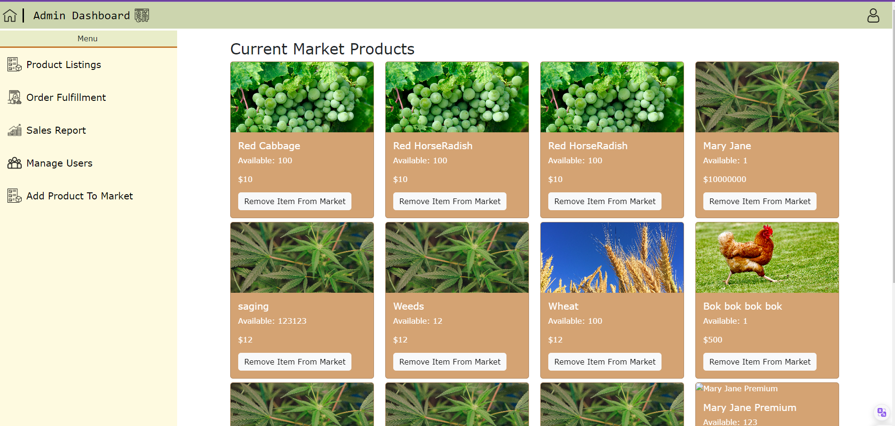

# HOW TO RUN THE WEBSITE
 PRE-REQUIISTES TO RUNNING THE SITE
 * MUST HAVE MONGODB INSTALLED 
 WITH A DATABASE NAMED 'Farm2Table' and must have 3 collections within it named "orders", # "products", and "users"

* IN TERMINAL change directory to the project folder (RUN BACKEND)
then change directory to backend "cd backend"
then type "npm start" to run the backend

* REPEAT THE PROCEDURE IN ANOTHER TERMINAL      (RUN FRONTEND)
with the exception of "cd backend" in a new terminal "cd frontend"
to run the frontend part of the website

# GENERAL RUNDOWN OF WEBSITE UPON LAUNCH

# FOR USERS

Here you can signup as new user or login if you are already an existing user
 +A prompt will show on succesful login and will direct to user shop page

Upon Login user can choose immediatly a product from the assortment provided the user can also toggle between viewing crops or poultry products, and choose to add them to the cart below
 + A prompt will show that the user has added a product to the shopping cart
 + A prompt will also show when the cart already has that item

Image below shows a cart where user can view added items as well as remove items. 

# FINALIZING ORDERS

Click the Cart here all contents of shopping cart can be viewed here as well as confirm the amount of the purchase.
Wherein the user can finish shopping by pressing the Finalize Order button bellow

+ All items added to the cart have data persistence and will stay on local storage until user logsout

# VIEW ALL PENDING ORDERS

Click the Delivery car to view pending and completed orders.  Under this section  you can see all the orders you have processed that is either complete or still processing

# Profile and Logout

Click the Profile Icon here the user can choose to view profile info and logout from the website

# FOR ADMINS
# CAN ONLY ACCESS USING /admin-dashboard

# please look at the segment for bugs and work in progress for information regarding ADMIN LOGIN

# Admin Products Listing

Here admins can look at all listed products and choose to remove them from the market

# Order Fullfilment

Click the SideMenu Sales Report, Here Admins can choose to process the order of the users 

# Sales Report 

Click the SideMenu Sales Report, Here Admins can view the sales of the products

# Manage Users

Click the SideMenu Manage Users, Here Admins can View all the Users  

# Adding Product

Click the SideMenu Add Product to Market, here Admins can add a product to the market

# BUGS AND WORK IN PROGRESS

+ No Authorization check for admin accounts, all logins will direct to user even admin accounts
+ No Order Completion function for the Admin, hence no orders are confirmed
+ When user attempts to login while user is still logged by configuring url nothing will render since user must be logged out first and clear the data stored in order to login in again
+ No Login way to acces Admin Account Except through unauthorized url configuration
+ Problem with NavBar Layout for Admin, Admin has redundant functions in navbar that is exclusive to users only, hence admin can view orders and shop
